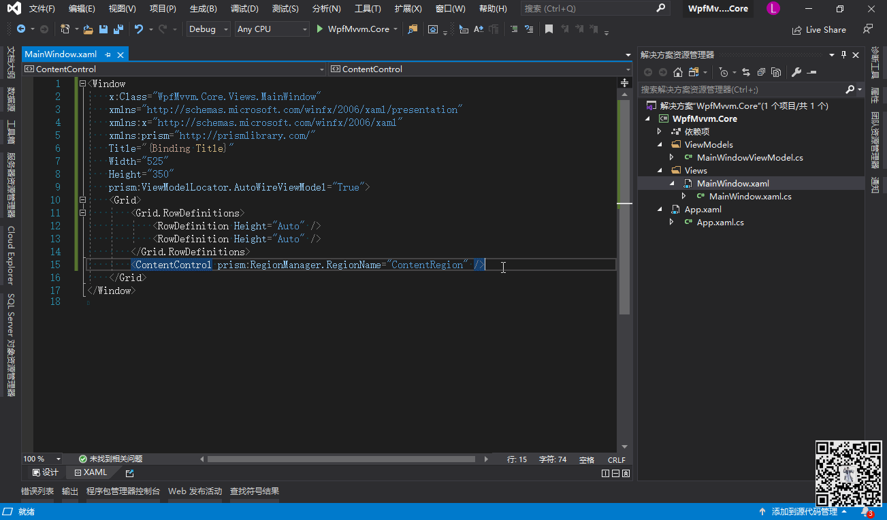
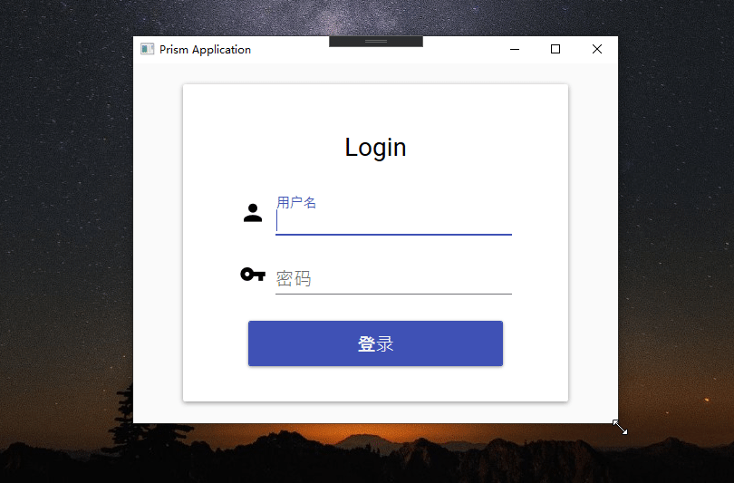

# 自己紹介

>## 概要
- 内視鏡、病院検診検査、POS機販売、通信交換機など関連の知識があります
- 9年.NET（WPF、UWP、Xamarin.Froms、WinForm、ASP.NETなど）開発経験
- ソリューション構築と、要件定義から運転保守までの経験をお持ちます

>## 経歴
- 2011.09　検査システム開発（兵庫県姫路）
- 2012.07　健診システム開発（石川県野々市）
- 2013.04　学園システム運営（大阪<->湖州）
- 2013.06　POSシステム開発（東京田町）
- 2015.07　Webシステムとアプリケーション開発（東京竹芝）
- 2017.08　通信基幹システムの運転保守（東京天王洲アイル<->大連）
- 2018.10　アプリとツール開発（東京北八王子<->大連）

>## 得意分野
- システムのアーキテクチャとデザイン
- システムの提案、設計、開発、試験、運用
- オフショアメンバーの連携と教育

>## 趣味
- ラーニング
- 登山（富士山登頂2回）

>## 言語
- 日本語(ビジネス)
- 中国語(ネイティブ)
- 英語(日常会話)

>## その他
- 技術共有のため、ブログも開設しています 
[https://www.cnblogs.com/lixiaobin](https://www.cnblogs.com/lixiaobin)

>## 技術
- OS: 
  - Windows
  - Linux
  - IOS
- Develop Lanugae: 
  - C#
  - JavaScript
  - Python
  - Ruby
  - PHP
- Framework:
  - WPF
  - Asp.Net MVC
  - Xamarin.Froms
  - EntityFramework
  - Prism
  - Dapper
  - Jquery
  - VueJs
  - Angular
  - MaterialDesign
  - [Odoo](https://www.odoo.com/ja_JP/)
  - etc...
- Cloud Platform:
  - Azure
  - AWS
  - Alibaba
- DataBase:
  - PostgreSQL
  - MySql
  - Oracle
  - SqlServer
  - Sqlite

>## 開発スピード

>## サンプル

